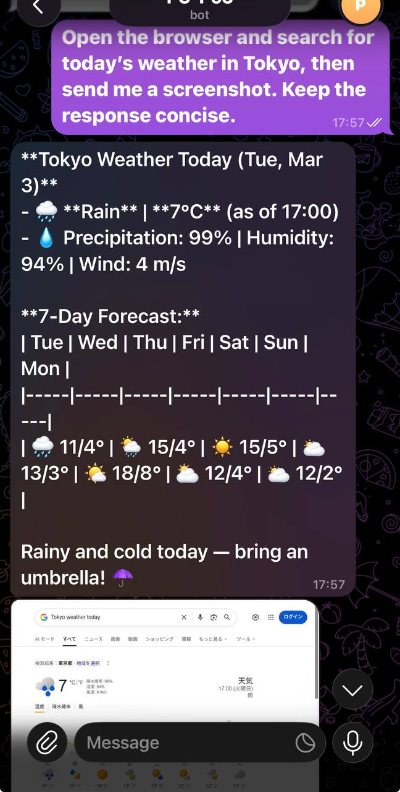

# Telegram Webhook for Copilot CLI

---

## Overview

This project is:

* **Highly transparent** — all operations are visible
* **Highly controllable** — you decide what to authorize
* **Low complexity** — single local agent
* **Extensible** — scales without redesigning

The minimal trust foundation for AI to safely interact with your personal data. Provides a **minimal controllable architecture**:

```
Telegram (phone)
      ↓
Cloudflare Tunnel (fixed domain / HTTPS)
      ↓
localhost:8000 (Webhook)
      ↓
Single Agent (Copilot CLI, local execution)
```

Core principles:

* Agent always runs locally
* All operations are visible
* Permissions granted incrementally
* Human can take control at any time

This is not "wire AI into everything" — it establishes an **auditable trust path**.



---

## The Problem It Solves

Most AI agents are deployed in sandboxes and are not allowed to access personal data for one reason: **uncontrollable risk**.

Once connected to:

* Private calendar
* Local documents
* Chat applications
* Browser operations

Without visibility and permission boundaries, security hazards emerge.

This architecture provides:

* Local execution
* Telegram as a visible control console
* Tunnel as a secure entry point

Enabling "remote command, local execution."

---

## Real Use Cases

| Scenario | How It Works |
| -------- | ------------ |
| Restaurant booking | Agent operates browser → sends screenshot → you confirm |
| Document organization | Process local directories, nothing touches cloud |
| Draft a message | Generate draft → review → authorize send |
| Contract data entry | Agent handles formatting → you verify key fields |

Key principle:

> Grant read permission first, write permission only after verification.
> See results first, authorize execution second.

---

## Prerequisites

* Windows + PowerShell
* Python 3.11+
* `uv` installed
* Copilot CLI available (or custom command)
* Telegram Bot Token from BotFather

---

## Setup

### 1. Environment Preparation

```
Copy .env.example to .env
Fill in BOT_TOKEN
Run: uv sync
```

### 2. Choose Tunnel Mode

#### Option A: Permanent Public URL (recommended)

In `.env`:
```
PUBLIC_URL=https://your-domain.example.com
```

Then run:
```powershell
.\start.ps1
```

#### Option B: Cloudflare Quick Tunnel

Just run:
```powershell
.\start.ps1
```

Quick Tunnel URL changes on every restart. Use a fixed tunnel for production.

---

## Security Setup

### 1. User Whitelist

After starting the server, send any message to your bot, then check the log:

```powershell
Get-Content .\uvicorn.log -Tail 20
```

Find a line like:

```
[telegram] message from user_id=123456789 text='hello'
```

Add it to `.env` and restart:

```ini
ALLOWED_USER_IDS=123456789
```

```powershell
.\start.ps1
```

### 2. Permission Control Philosophy

* Default: read-only
* Key steps: manual confirmation required
* High-risk commands: reviewed one by one
* Process can be stopped at any time

Approval model (MVP):

* Plan-first (action planning) is enabled by default.
* If plan parsing fails or confidence is too low, the request fails closed into approval.
* Any network action with newly seen/unauthorized domains always requires approval.
* Evidence screenshots are controlled by planned `needs_evidence`.
* High-risk requests are denied by default and converted into a Telegram approval card.
* Inline buttons:
      * ✅ One-time only
      * 🔁 Allow same risk type for this conversation
      * 📁 Allow same risk type for this project
      * 🤖 Allow same risk type for this agent (shown only when an agent is set)
      * ❌ Deny
* Layered permission resolution: user > agent > project > conversation > one-time.
* Allow grants inherit downward; deny applies only to the current pending request.

Execution receipt format:

* Every execution reply is always two-stage:
      * `1,<result summary...>`
      * `2,<detailed process...>`
* Silent mode is removed (`--silent` is no longer used).

This model supports "incremental permission granting."

### Shadow Enforcement (Feature Flag)

* Default-off kill switch: `SHADOW_ENFORCEMENT_ENABLED=false` keeps decision/execution behavior on the legacy path, while shadow audit events remain additive.
* Scope `SHADOW_ENFORCEMENT_SCOPE=deny_only`:
      * shadow strategy `deny` is hard-blocked (no pending approval card, no execution).
* Scope `SHADOW_ENFORCEMENT_SCOPE=deny_and_challenge`:
      * includes `deny_only` behavior;
      * shadow strategy `challenge` is forced into approval flow.
* Invalid scope values automatically fall back to `deny_only`.

---

## Telegram Commands

| Command | Description |
| ------- | ----------- |
| `/help` | Show help |
| `/new` | Start new Copilot session |
| `/sessions` | List recent sessions |
| `/session <id>` | Switch to session by numeric id from `/sessions` |
| `/agents` | List available agents with numeric ids (`1` is `none`) |
| `/agent <id>` | Set current agent by numeric id (passed as `--agent <name>`) |
| `/models` | List available models with numeric ids and multipliers (`x0/x1/x3`) |
| `/model <id>` | Set current model by numeric id (passed as `--model <id>`) |

Normal messages automatically continue the current session.

---

## Persistence & Audit

* `approval_store.json`: stores grants, pending approvals, user session/agent/model mappings.
* `audit_log.jsonl`: append-only audit trail for approval and execution events.
* `callback_query` updates are handled and always acknowledged with `answerCallbackQuery`.

### Offline Audit Analyzer (C-Phase4)

Use the stdlib-only analyzer to review audit quality and replay confidence thresholds offline:

```powershell
# Basic analysis (default: ./audit_log.jsonl, Asia/Shanghai)
python .\scripts\audit_analyzer.py

# Time/User filter + custom thresholds + JSON output
python .\scripts\audit_analyzer.py --since 2026-03-09 --until 2026-03-09T23:59:59 --user-id 7212596491 --replay-thresholds 0.6,0.7,0.8,0.9 --json-out .\audit_summary.json
```

Caveat: historical records may miss fields such as `plan_first_mode`; replay reports any assumptions explicitly in output/hints.

---

## System Architecture

The system is structured in five layers with strict separation of concerns. `server.py` serves only as an orchestrator; all policy logic is centralized in the `core/` package.

| Layer | Component | Description |
|---|---|---|
| Transport | Telegram Bot API | Phone → Bot → Webhook |
| Reception | `server.py` | Parse Update, build `MessageContext` |
| Policy | `core/policy_engine.py`<br>`core/approval_flow.py` | Static risk analysis → policy decision → approval gate |
| Execution | `gh copilot` CLI | Plan + execute with `--resume` session continuity |
| Audit | `audit_log.jsonl` | Append-only event stream with offline replay analysis |

Core modules:

```
core/
├── policy_engine.py    # Pure-function policy decisions (no I/O)
├── approval_flow.py    # Four-level authorization state machine (dependency injection)
├── pipeline_context.py # MessageContext dataclass
├── runtime_state.py    # Configuration / persistence / audit logging
└── telegram_io.py      # Telegram transport helpers
```

Detailed architectural reference → [docs/architecture.md](docs/architecture.md)
